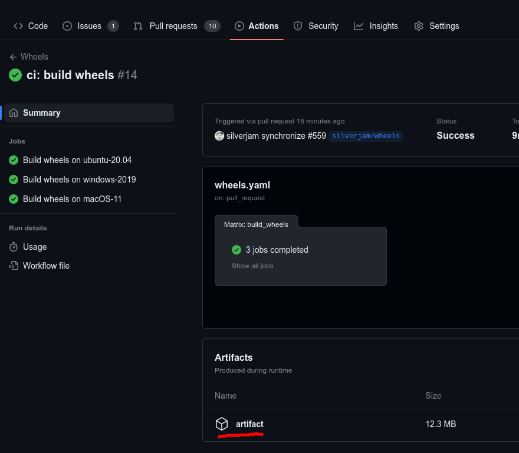
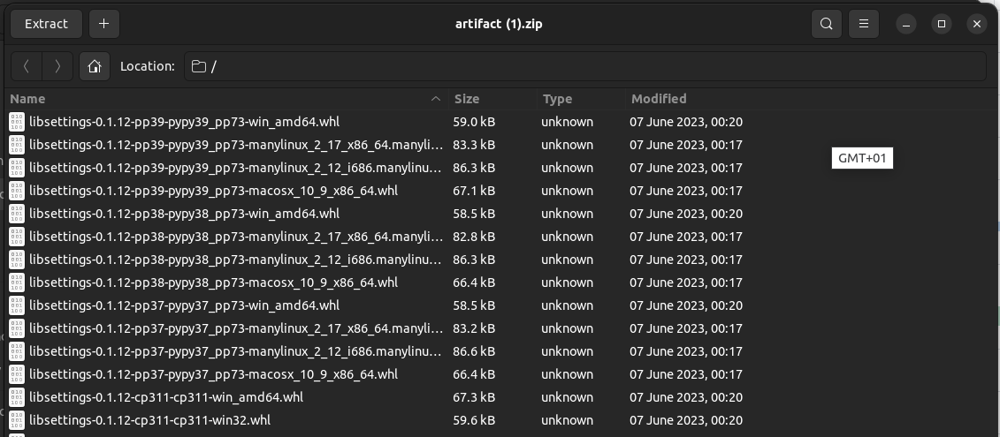

# libsettings

Open source SwiftNav settings API library.

`libsettings` aims to provide a standardized settings framework for projects accessing Piksi settings.

## Bindings

This repository includes [python](./python) bindings.  For rust bindings see
[libsettings-rs](https://github.com/swift-nav/libsettings-rs).

## Building

### Unix

#### Output

* .so can be found under `build/src/`
* Python distribution package can be found under `dist/`

#### Prerequisities

* Python
* pip
* CMake
* conda environment or virtualenv (via `pip install virtualenv`)

You can do without 'virtualenv' but beaware that in this case contents of
`requirements-dev.txt` shall be installed to your Python environment. You can
specify the Python version while calling 'cmake' otherwise the default one is
used.

#### Commands

To build the native (C) code:

``` sh
mkdir build
cd build
cmake .. # If you want to specify python version: 'cmake -D PYTHON=python3 ..'
make
cd ..
```

#### Source distribution package creation (Python)

Run

``` sh
pip install build
python -m build --sdist
```

### Windows

Architecture (32/64-bit) is determined by conda installation.

#### Output

* .dll and .lib can be found under `build/src/Release/`
* Python distribution package can be found under `dist/`

#### Prerequisities for Python 3.7.x and above

* conda
* Microsoft Visual C++ 14.0, for example from:
  https://visualstudio.microsoft.com/downloads/#build-tools-for-visual-studio-2017

#### Commands for Python 3.7.x and above

``` sh
python -m build --wheel
```

#### Prebuilt wheels creation

We use <https://cibuildwheel.readthedocs.io/en/stable> to create wheels.

## Releasing

To release, do the following:
- Update `setup.py` for the new version number: `sed s/0.1.12/0.1.13/g setup.py`
- Commit the version update: `git commit -a -m "release: version 0.1.13"`
- Push the release to GitHub: `git push origin 0.1.13 master`

Then, visit the "Wheels" CI build output to download for the tag and download the "artifact" zip file:



This will contain all of the build wheels:



Unzip this archive and use Twine to upload to PyPI:

```
mkdir libsettings-0.1.13
cd libsettings-0.1.13
unzip ~/Downloads/artifact.zip
twine upload -u $PYPI_USERNAME -p PYPI_PASSWORD
```

## Sanity check

To test your build you should search for the built distribution package under
`dist` directory. Install it using ´pip´ and then:

``` sh
python python/settings_client.py --tcp -p 192.168.0.222:55555
```

## Installing from package managers

Some bindings are available on package managers:

* [`python`]: available on [PyPI](https://pypi.org/project/libsettings/): `pip install libsettings`
* [`rust`]: available on [cargo](https://crates.io/crates/sbp-settings): `cargo add install libsettings`
